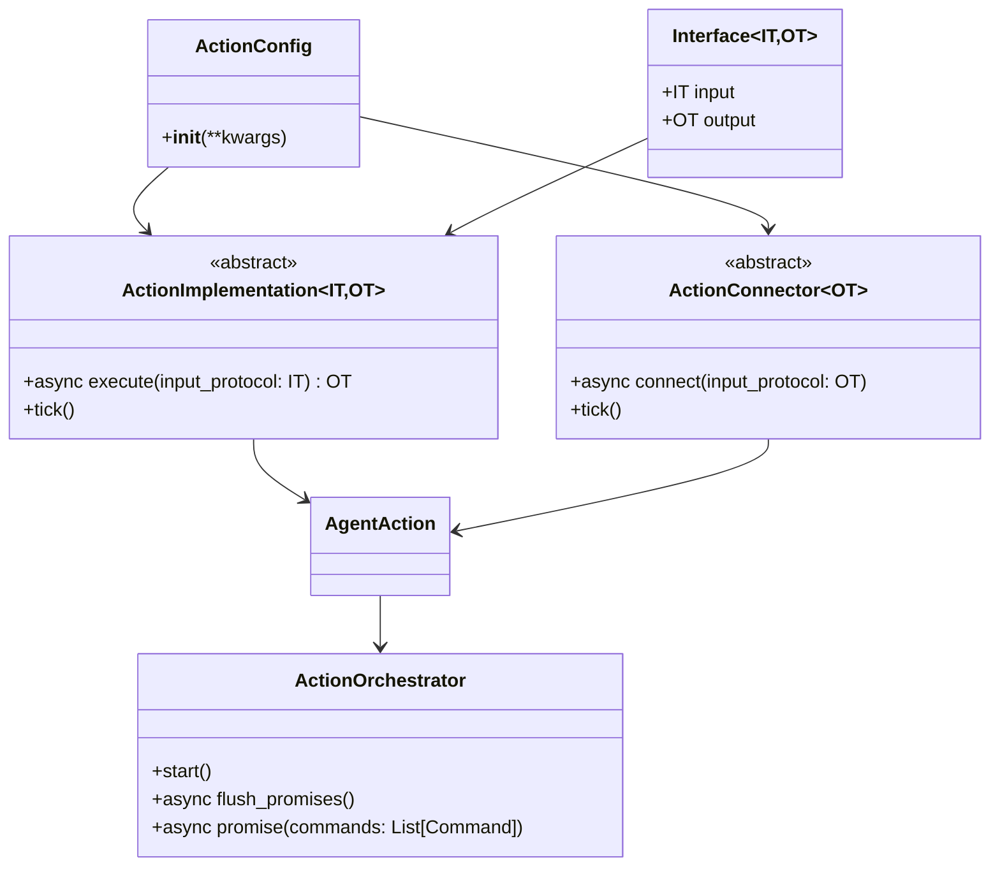
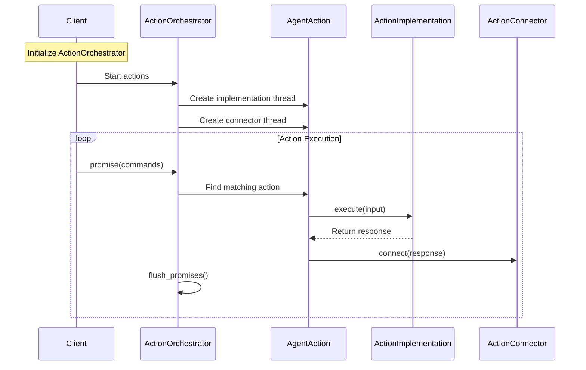
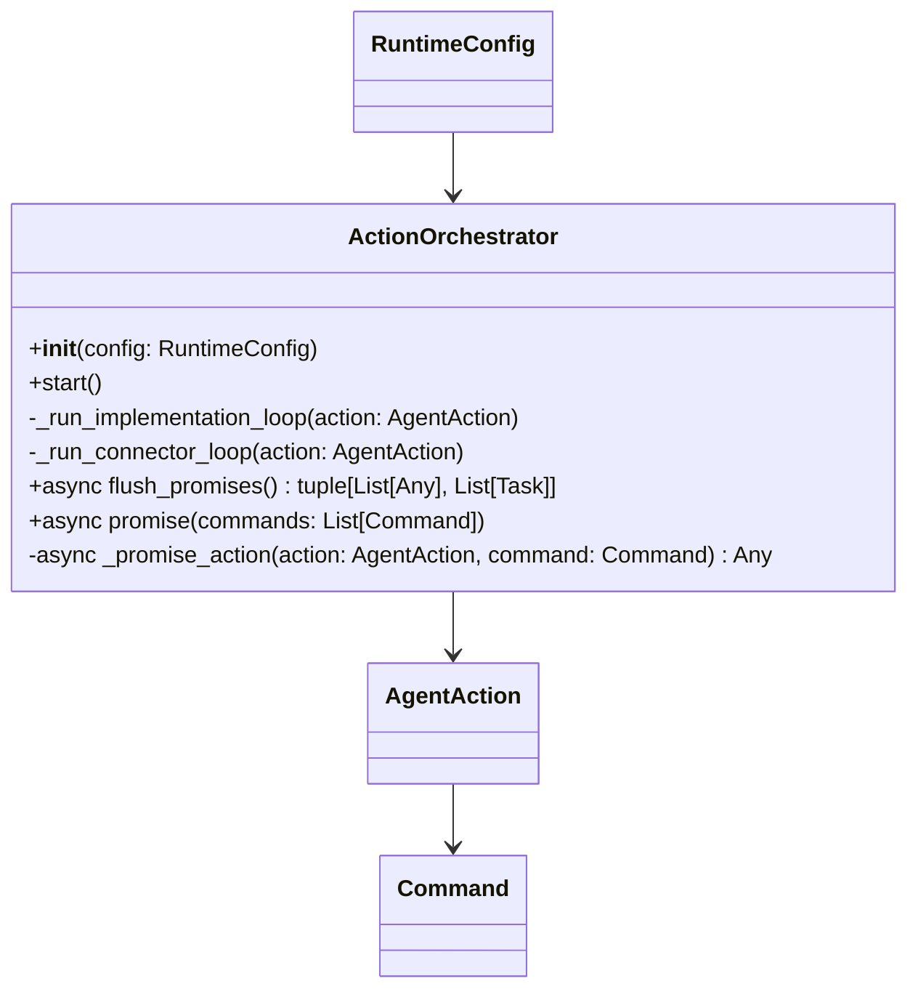

## Action Plugins

The Action Plugins are a core component of OM1. Actions enable LLMs control physical robot hardware. 

It serves as the output mechanism for the agent, translating high-level decisions from the Large Language Model (LLM) into concrete physical or digital actions (e.g. moving a robot, speech, etc.). This page covers the architecture of the Action Plugin, the available action types, and how actions are connected to different hardware and software platforms.

[github codes](https://github.com/OpenmindAGI/OM1/tree/main/src/actions)


## Movement through ROS2

The Movement through ROS2 action plugin allows agents to move a robot in a simulated or real robot using ROS2.

[github example](https://github.com/OpenmindAGI/OM1/blob/main/src/actions/move/connector/ros2.py)


## Movement through Zenoh

The Movement through Zenoh action plugin allows agents to move a robot in a simulated or real robot using Zenoh.
In this page, we will use the [Move Turtle](https://github.com/OpenmindAGI/OM1/tree/main/src/actions/move_turtle) as an example.

## Speech and TTS

The Speech and TTS action plugin allows agents to speak aloud with a text-to-speech (TTS) system.

[github codes](https://github.com/OpenmindAGI/OM1/blob/main/src/actions/speak/connector/elevenlabs_tts.py)

## configuration parameters

```
# Example usage
config = ActionConfig(
    api_key="your_api_key",
    elevenlabs_api_key="your_elevenlabs_key",
    voice_id="custom_voice_id",
    model_id="eleven_flash_v2_5",
    output_format="mp3_44100_128",
    microphone_device_id="mic_id",
    speaker_device_id="speaker_id"
)
connector = SpeakElevenLabsTTSConnector(config)
await connector.connect(SpeakInput(action="Hello, world!"))
```

## example configuration

```
    {
      "name": "speak",
      "llm_label": "speak",
      "implementation": "passthrough",
      "connector": "elevenlabs_tts",
      "config": {
        "voice_id": "i4CzbCVWoqvD0P1QJCUL"
      }
    }
```

## Action Plugin Architecture Class Diagram

In order to simplify the diagram, we only show the most important classes and their relationships.

Core components of the Action Plugin:



## Data Flow



## Action Orchestrator

The Action Orchestrator is the central component that orchestrates the execution of actions. It manages the states, promise queue, and threads for each action.

[github codes](https://github.com/OpenmindAGI/OM1/blob/main/src/actions/orchestrator.py)

### Orchestrator architecture class diagram

In order to simplify the diagram, we only show the most important classes and their relationships.



## Example configuration

```
  "agent_actions": [
    {
      "name": "move",
      "llm_label": "move",
      "implementation": "passthrough",
      "connector": "ros2"
    },
    {
      "name": "speak",
      "llm_label": "speak",
      "implementation": "passthrough",
      "connector": "ros2"
    }
  ]
```

## Adding New Actions

Actions are the core capabilities of an agent. For example, for a robot, these capabilities are actions such as movement and speech. Each action consists of:

1. Interface (`interface.py`): Defines input/output types.
2. Implementation (`implementation/`): Business logic, if any. Otherwise, use passthrough.
3. Connector (`connector/`): Code that connects `OM1` to specific virtual or physical environments, typically through middleware (e.g. custom APIs, `ROS2`, `Zenoh`, or `CycloneDDS`)

Example action structure:

```tree Example Action Structure
actions/
└── move_{unique_hardware_id}/
    ├── interface.py      # Defines MoveInput/Output
    ├── implementation/
    │   └── passthrough.py
    └── connector/
        ├── ros2.py       # Maps OM1 data/commands to hardware layers and robot middleware
        ├── zenoh.py
        └── unitree.py
```

In general, each robot will have specific capabilities, and therefore, each action will be hardware specific. For example, if you are adding support for the Unitree G1 Humanoid version 13.2b, which supports a new movement subtype such as `dance_2`, you could name the updated action `move_unitree_g1_13_2b` and select that action in your `unitree_g1.json` configuration file.