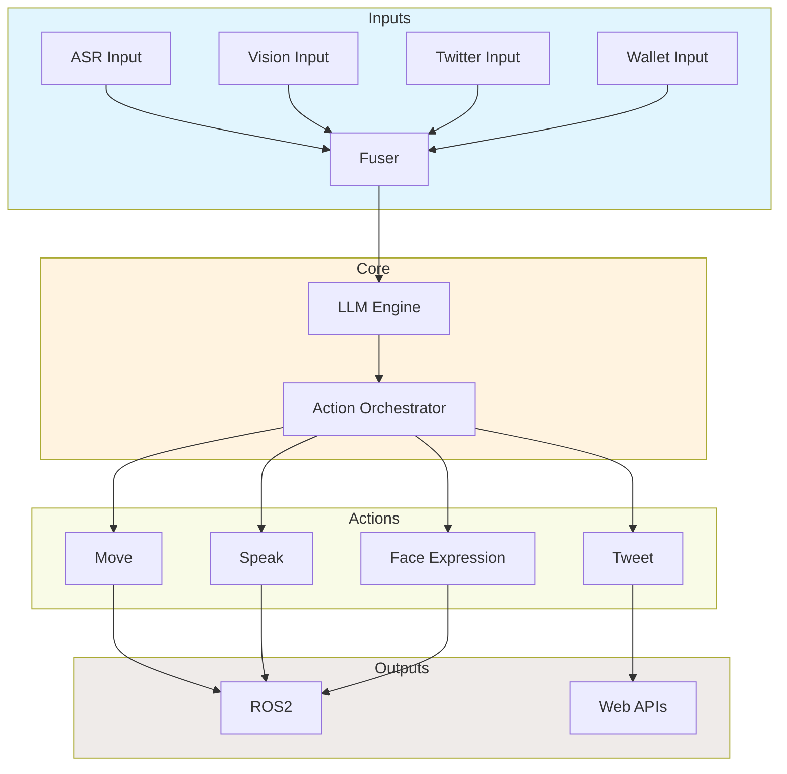
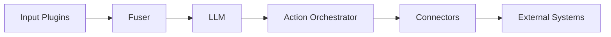

<Note>
  This document outlines the high-level architecture and data flow of the OM1 system.
</Note>

## Overview

OM1 implements a high-performance event loop architecture operating at a configurable frequency (`self.config.hertz`). The system processes data through a pipeline of collection, fusion, reasoning, and action execution.



## Core Components

<CardGroup cols={2}>
  <Card title="Input Collection" icon="arrow-down-to-bracket">
    Input plugins gather data from various sources including vision systems, audio processing, network APIs, blockchain events, and hardware sensors.
  </Card>
  
  <Card title="Data Fusion" icon="layer-group">
    The Fuser component aggregates multi-modal inputs and constructs coherent prompts for LLM processing.
  </Card>

  <Card title="Reasoning Engine" icon="brain">
    Processes fused inputs through configured LLM and generates structured command outputs.
  </Card>

  <Card title="Action Execution" icon="play">
    The ActionOrchestrator validates commands and routes them to appropriate handlers.
  </Card>
</CardGroup>

## Runtime Flow



## Code Example

Here's a simple example of configuring an agent:

```json
{
  "hertz": 1,
  "name": "example_agent",
  "system_prompt_base": "You are a helpful AI assistant...",
  "agent_inputs": [
    {
      "type": "ASRInput"
    }
  ],
  "cortex_llm": {
    "type": "OpenAILLM",
    "config": {
      "api_key": "your_key_here"
    }
  }
}
```

## Performance Considerations

<Accordion title="Asynchronous Operations">
  The system uses async/await throughout the pipeline for non-blocking operations.
</Accordion>

<Accordion title="Thread Safety">
  State management is handled through thread-safe singletons and locks.
</Accordion>

<Accordion title="Error Handling">
  Comprehensive error handling and recovery mechanisms are implemented at each stage.
</Accordion>

## API Reference

<ResponseField name="hertz" type="number">
  The frequency at which the main loop operates (Hz)
</ResponseField>

<ResponseField name="name" type="string">
  Unique identifier for the agent instance
</ResponseField>

<ResponseField name="system_prompt_base" type="string">
  Base prompt that defines agent behavior
</ResponseField>

## External Integrations

The system connects to various external systems through standardized connectors:

<Steps>
  <Step title="ROS2">
    Integration with the Robot Operating System 2 framework
  </Step>
  <Step title="Zenoh">
    High-performance pub/sub and data distribution
  </Step>
  <Step title="CycloneDDS">
    Industrial-grade data distribution service
  </Step>
  <Step title="Custom APIs">
    Support for custom API endpoints and protocols
  </Step>
</Steps>

```python Core Runtime System
# /src/runtime/cortex.py
async def _run_cortex_loop(self) -> None:
    while True:
        await asyncio.sleep(1 / self.config.hertz)
        await self._tick()

async def _tick(self) -> None:
    finished_promises, _ = await self.action_orchestrator.flush_promises()
    prompt = self.fuser.fuse(self.config.agent_inputs, finished_promises)
    output = await self.config.cortex_llm.ask(prompt)
    logging.debug("I'm thinking... ", output)
    await self.action_orchestrator.promise(output.commands)
```