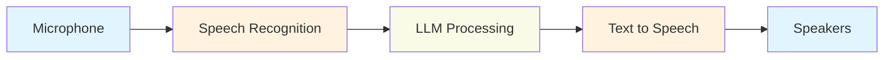

<Note>
  The conversation agent demonstrates natural voice interaction using your system's microphone and speakers, powered by OpenMind's cloud services for speech processing.
</Note>

## Overview



## Quick Start

<Steps>
  <Step title="Check Audio Setup">
    Verify your system's default audio devices:
    - Microphone is connected and active
    - Speakers are working and at appropriate volume
    - No other applications are using the audio devices
  </Step>

  <Step title="Install Audio Drivers">
    <CodeGroup>
      ```bash Mac
      brew install portaudio
      ```
      ```bash Ubuntu/Debian
      sudo apt-get update
      sudo apt-get install portaudio19-dev python-all-dev
      ```
      ```bash Fedora
      sudo dnf install portaudio-devel
      ```
    </CodeGroup>
  </Step>

  <Step title="Run the Agent">
    ```bash
    uv run src/run.py conversation
    ```
  </Step>
</Steps>

## Configuration

The conversation agent uses this configuration:

```json
{
  "hertz": 0.01,
  "name": "conversation",
  "system_prompt_base": "You are a smart, curious, and friendly AI...",
  "agent_inputs": [
    {
      "type": "ASRInput",
      "config": {
        "endpoint": "wss://api.openmind.org/v1/asr"
      }
    }
  ],
  "agent_actions": [
    {
      "name": "speak",
      "implementation": "passthrough",
      "connector": "tts"
    }
  ]
}
```

## Features

<CardGroup cols={2}>
  <Card title="Real-time ASR" icon="microphone">
    Continuous speech recognition with low latency
  </Card>
  
  <Card title="Natural TTS" icon="volume-high">
    High-quality voice synthesis for responses
  </Card>
  
  <Card title="Context Aware" icon="brain">
    Maintains conversation context for natural dialogue
  </Card>
  
  <Card title="Error Recovery" icon="shield-check">
    Handles audio device issues gracefully
  </Card>
</CardGroup>

## Troubleshooting

<Accordion title="No Audio Input">
  1. Check system audio settings
  2. Verify microphone permissions
  3. Try unplugging and reconnecting the microphone
  4. Test microphone in another application
</Accordion>

<Accordion title="No Audio Output">
  1. Check system volume
  2. Verify speaker selection
  3. Test audio with a different application
  4. Try restarting the agent
</Accordion>

<Accordion title="High Latency">
  1. Check your internet connection
  2. Close other resource-intensive applications
  3. Consider adjusting the `hertz` value in configuration
</Accordion>

## Advanced Usage

### Custom Voice Settings

<ResponseField name="VOICE_ID" type="string">
  Set a specific voice for TTS:
  ```bash
  export VOICE_ID="en-US-Neural2-F"
  ```
</ResponseField>

### Debug Mode

Enable detailed logging:
```bash
uv run src/run.py conversation --debug
```

### Audio Device Selection

<CodeGroup>
```python Default Devices
# Uses system defaults
python src/run.py conversation
```

```python Custom Devices
# Specify devices
AUDIO_INPUT_DEVICE=1 AUDIO_OUTPUT_DEVICE=2 python src/run.py conversation
```
</CodeGroup>

## Example Interactions

<CodeGroup>
```text Basic
User: "What's the weather like?"
Agent: "I don't have access to real-time weather data, but I'd be happy to chat about other topics!"
```

```text Memory
User: "My name is Alice"
Agent: "Nice to meet you, Alice! How can I help you today?"
User: "What's my name?"
Agent: "Your name is Alice, as you mentioned earlier!"
```
</CodeGroup>

## Performance Tips

1. Use a high-quality microphone for better recognition
2. Speak clearly and at a moderate pace
3. Minimize background noise
4. Position microphone correctly (about 6-12 inches away)
5. Use headphones to prevent audio feedback

## Next Steps

<CardGroup cols={2}>
  <Card
    title="Add Actions"
    icon="plus"
    href="/docs/development/actions"
  >
    Extend with movement and expressions
  </Card>
  
  <Card
    title="Custom Prompts"
    icon="pen"
    href="/docs/development/prompts"
  >
    Customize agent personality
  </Card>
</CardGroup>
