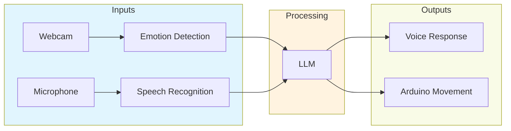

<Note>
  Cubly demonstrates OM1's multi-modal capabilities by combining emotion detection, voice interaction, and physical movement to create an engaging interactive experience.
</Note>

## System Overview



## Quick Start

<Steps>
  <Step title="Hardware Setup">
    Ensure you have:
    - Webcam (built-in or USB)
    - Microphone
    - Speakers
    - Arduino with USB connection (optional)
  </Step>

  <Step title="Run Cubly">
    ```bash
    uv run src/run.py cubly
    ```
    <Note>
      Initial startup may take a few minutes to download required ML models and dependencies.
    </Note>
  </Step>

  <Step title="Check WebSim">
    Open the WebSim simulator window to monitor:
    - Emotion detection
    - Speech recognition
    - System responses
    - Movement commands
  </Step>
</Steps>

## Components

<CardGroup cols={2}>
  <Card title="Emotion Detection" icon="face-smile">
    Uses OpenCV for real-time facial analysis:
    ```python
    # /inputs/plugins/webcam_to_face_emotion
    cv2.CascadeClassifier('haarcascade_frontalface_default')
    ```
  </Card>
  
  <Card title="Voice Processing" icon="microphone">
    Cloud-based ASR using NVIDIA RIVA:
    ```python
    # /inputs/plugins/asr
    RivaASR(endpoint="api.openmind.org")
    ```
  </Card>
  
  <Card title="Speech Synthesis" icon="volume-high">
    Neural TTS for natural responses:
    ```python
    # /actions/speak/connector/tts
    TTSConnector(voice_id="en-US-Neural2-F")
    ```
  </Card>
  
  <Card title="Movement Control" icon="robot">
    Arduino-based servo control:
    ```python
    # /actions/move_serial_arduino/connector/serial_arduino
    SerialArduinoConnector(port="/dev/ttyUSB0")
    ```
  </Card>
</CardGroup>

**NOTE**. There will be an initial delay for your system to download various packages and AI/ML models. 

**NOTE**. Arduino based movement generation only works if you actually have a suitable actuator connected to an Arduino, which is to your computer via a USB serial dongle. On Mac, you can determine the correct serial port name to use via `ls /dev/cu.usb*`. If you do not specify your computer's serial port, the example will provide logging data that simulates what it would send.


## Hardware Configuration

### Arduino Setup

<Accordion title="Serial Port Configuration">
  Find your Arduino port:
  <CodeGroup>
    ```bash Mac/Linux
    ls /dev/cu.usb*     # Mac
    ls /dev/ttyUSB*     # Linux
    ```
    ```bash Windows
    # Use Device Manager to find COM port
    COM1, COM2, etc.
    ```
  </CodeGroup>
</Accordion>

<Note>
  Without an Arduino, Cubly will run in simulation mode, logging movement commands instead of sending them to hardware.
</Note>

## Configuration

Key settings in `config/cubly.json`:

```json
{
  "name": "cubly",
  "hertz": 1,
  "agent_inputs": [
    {
      "type": "WebcamEmotionInput",
      "config": {
        "camera_id": 0
      }
    },
    {
      "type": "ASRInput",
      "config": {
        "endpoint": "wss://api.openmind.org/v1/asr"
      }
    }
  ],
  "agent_actions": [
    {
      "name": "speak",
      "implementation": "passthrough",
      "connector": "tts"
    },
    {
      "name": "move",
      "implementation": "passthrough",
      "connector": "serial_arduino"
    }
  ]
}
```

## Troubleshooting

<Accordion title="Webcam Issues">
  1. Check webcam permissions
  2. Verify camera ID in configuration
  3. Ensure good lighting
  4. Test webcam in another application
</Accordion>

<Accordion title="Arduino Connection">
  1. Verify correct port name
  2. Check USB connection
  3. Install Arduino drivers if needed
  4. Confirm Arduino has correct firmware
</Accordion>

<Accordion title="Performance">
  1. Close other resource-intensive applications
  2. Ensure good internet connection for cloud services
  3. Monitor CPU and memory usage
</Accordion>

## Example Interactions

<CodeGroup>
```text Happy User
Detected: Smiling face
Speech: "Hello Cubly!"
Response: "Hi! You look happy today! *waves*"
Action: Servo movement - wave pattern
```

```text Confused User
Detected: Furrowed brow
Speech: "What can you do?"
Response: "I can see your expressions and move!"
Action: Demonstration movements
```
</CodeGroup>

## Next Steps

<CardGroup cols={2}>
  <Card
    title="Custom Movements"
    icon="gears"
    href="/docs/hardware/arduino"
  >
    Program new movement patterns
  </Card>
  
  <Card
    title="Emotion Training"
    icon="brain"
    href="/docs/vision/training"
  >
    Improve emotion detection
  </Card>
</CardGroup>