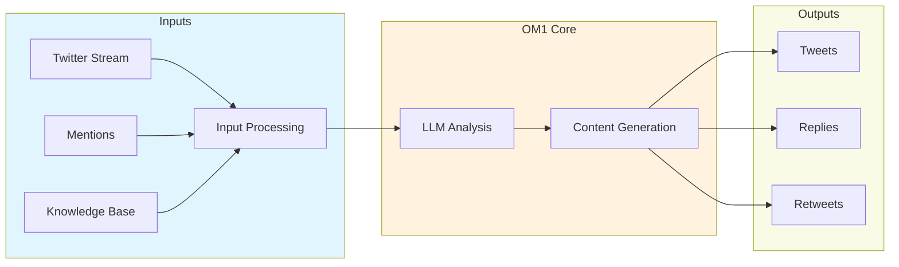

<Note>
  Create an intelligent Twitter bot that can monitor feeds, engage with users, and share knowledge using OM1's Twitter integration.
</Note>

## System Overview



## Quick Start

<Steps>
  <Step title="Twitter Developer Setup">
    1. Create a [Twitter Developer Account](https://developer.twitter.com)
    2. Create a new Project and App
    3. Generate API credentials
    4. Enable OAuth 1.0a
  </Step>

  <Step title="Environment Configuration">
    Create `.env` file:
    ```env
    TWITTER_API_KEY=your_api_key
    TWITTER_API_SECRET=your_api_secret
    TWITTER_ACCESS_TOKEN=your_access_token
    TWITTER_ACCESS_TOKEN_SECRET=your_token_secret
    TWITTER_BEARER_TOKEN=your_bearer_token
    ```
  </Step>

  <Step title="Bot Configuration">
    Create `config/twitter_agent.json`:
    ```json
    {
      "hertz": 0.2,
      "name": "twitter_agent",
      "system_prompt_base": "You are an AI agent that shares knowledge from the OpenMind knowledge base...",
      "agent_inputs": [
        {
          "type": "TwitterInput",
          "config": {
            "query": "What are the latest developments in cryptocurrency?",
            "max_results": 10,
            "languages": ["en"]
          }
        }
      ],
      "agent_actions": [
        {
          "name": "tweet",
          "implementation": "passthrough",
          "connector": "twitterAPI",
          "config": {
            "rate_limit": 200,
            "min_delay": 3
          }
        }
      ]
    }
    ```
  </Step>

  <Step title="Launch">
    ```bash
    uv run src/run.py twitter_agent
    ```
  </Step>
</Steps>

## Features

<CardGroup cols={2}>
  <Card title="Stream Monitoring" icon="satellite-dish">
    - Real-time tweet tracking
    - Keyword filtering
    - Language detection
    - Sentiment analysis
  </Card>
  
  <Card title="Content Generation" icon="pen-fancy">
    - Context-aware responses
    - Hashtag optimization
    - Thread creation
    - Image caption generation
  </Card>
  
  <Card title="Engagement" icon="users">
    - Automated replies
    - Smart retweeting
    - Mention handling
    - Follow management
  </Card>
  
  <Card title="Safety" icon="shield-check">
    - Content filtering
    - Rate limiting
    - Error recovery
    - Spam prevention
  </Card>
</CardGroup>

## Example Outputs

<CodeGroup>
  ```json Knowledge Share
  {
    "type": "tweet",
    "content": "🤖 Just learned: Neural networks can now process sequences 1 million tokens long! This breakthrough in AI attention mechanisms could revolutionize long-form content analysis. #AI #MachineLearning",
    "media": null,
    "reply_to": null
  }
  ```

  ```json Engagement
  {
    "type": "reply",
    "content": "Thanks for asking! The key difference between supervised and unsupervised learning is that supervised learning requires labeled training data, while unsupervised learning finds patterns in unlabeled data. Hope this helps! #AIBasics",
    "reply_to": "1234567890"
  }
  ```
</CodeGroup>

## Rate Limiting

<Accordion title="Twitter API Limits">
  | Action | Rate Limit | Reset Window |
  |--------|------------|--------------|
  | Tweets | 200/hour   | 1 hour       |
  | Replies | 300/3hr   | 3 hours      |
  | Follows | 400/day   | 24 hours     |
</Accordion>

## Best Practices

<Steps>
  <Step title="Content Strategy">
    - Maintain consistent voice
    - Mix content types
    - Use trending hashtags
    - Include rich media
  </Step>
  
  <Step title="Engagement Rules">
    - Respond promptly
    - Stay on topic
    - Be transparent about AI
    - Follow community guidelines
  </Step>
  
  <Step title="Technical Setup">
    - Monitor API usage
    - Implement error handling
    - Back up credentials
    - Log interactions
  </Step>
</Steps>

## Troubleshooting

<Accordion title="Common Issues">
  <ResponseField name="Rate Limits">
    - Reduce `hertz` value
    - Implement exponential backoff
    - Monitor usage metrics
  </ResponseField>

  <ResponseField name="Auth Errors">
    - Verify API permissions
    - Check token expiration
    - Validate credentials
  </ResponseField>

  <ResponseField name="Content Issues">
    - Review prompt templates
    - Check character limits
    - Validate media uploads
  </ResponseField>
</Accordion>

## Next Steps

<CardGroup cols={2}>
  <Card
    title="Custom Plugins"
    icon="puzzle-piece"
    href="/docs/plugins/twitter"
  >
    Create custom Twitter integrations
  </Card>
  
  <Card
    title="Analytics"
    icon="chart-line"
    href="/docs/analytics"
  >
    Track bot performance
  </Card>
  
  <Card
    title="Multi-Account"
    icon="users-gear"
    href="/docs/scaling"
  >
    Manage multiple bots
  </Card>
  
  <Card
    title="Deployment"
    icon="rocket"
    href="/docs/deployment"
  >
    Deploy to production
  </Card>
</CardGroup> 