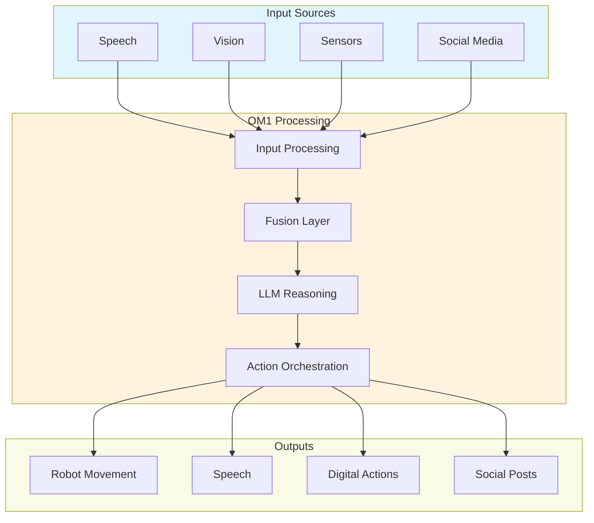

<Note>
  OpenMind's OM1 is a modular AI runtime that bridges the gap between AI models and real-world interactions, enabling seamless deployment across both digital and physical environments.
</Note>

## What is OM1?

OM1 is a powerful runtime system that allows AI agents to:
- Process multi-modal inputs (speech, vision, sensors)
- Make decisions using state-of-the-art LLMs
- Control physical robots and digital interfaces
- Interact naturally with humans and environments



## Key Features

<CardGroup cols={2}>
  <Card title="Modular Architecture" icon="puzzle-piece">
    Easily extend functionality with new inputs, actions, and integrations
  </Card>
  
  <Card title="Python-First" icon="python">
    Built entirely in Python for accessibility and rapid development
  </Card>
  
  <Card title="Multi-Modal" icon="layer-group">
    Process diverse input types: speech, vision, sensors, and APIs
  </Card>
  
  <Card title="Hardware Ready" icon="robot">
    Deploy to real robots with pre-built hardware support
  </Card>
</CardGroup>

## Supported Platforms

<Tabs>
  <Tab title="Robots">
    - Unitree Quadrupeds (Go1, A1)
    - TurtleBot 3 (Coming Soon)
    - Humanoid Robots (Coming Soon)
  </Tab>
  <Tab title="Digital">
    - Cloud Deployment
    - Social Media Integration
    - Web APIs
    - Custom Endpoints
  </Tab>
  <Tab title="Protocols">
    - ROS2
    - Zenoh
    - CycloneDDS
    - WebSocket
  </Tab>
</Tabs>

## Quick Example

Here's a simple example of an OM1 agent that can speak and move:

```python
# Configure your agent
config = {
    "name": "interactive_agent",
    "agent_inputs": [
        {"type": "ASRInput"}  # Speech recognition
    ],
    "agent_actions": [
        {
            "name": "speak",
            "implementation": "passthrough",
            "connector": "tts"
        },
        {
            "name": "move",
            "implementation": "passthrough",
            "connector": "ros2"
        }
    ]
}

# Run your agent
python src/run.py start interactive_agent
```

## Real-World Applications

<CardGroup cols={3}>
  <Card title="Social Robots" icon="robot">
    Create interactive robots for education, healthcare, and entertainment
  </Card>
  
  <Card title="Digital Assistants" icon="computer">
    Build AI agents that operate across digital platforms
  </Card>
  
  <Card title="Research" icon="flask">
    Prototype and test AI behaviors in controlled environments
  </Card>
</CardGroup>

## Getting Started

<Steps>
  <Step title="Installation">
    ```bash
    git clone https://github.com/openmind/om1.git
    cd om1
    python -m venv .venv
    source .venv/bin/activate
    pip install -r requirements.txt
    ```
  </Step>
  
  <Step title="Configuration">
    Create a `.env` file with your API keys:
    ```bash
    OPENAI_API_KEY=your_key_here
    ```
  </Step>
  
  <Step title="Run">
    Start with a basic conversation agent:
    ```bash
    python src/run.py start conversation
    ```
  </Step>
</Steps>

## Next Steps

<CardGroup cols={2}>
  <Card
    title="Quick Start"
    icon="play"
    href="./quick_start"
  >
    Get started with your first OM1 agent
  </Card>
  
  <Card
    title="Developer Guide"
    icon="code"
    href="./development/guide"
  >
    Learn how to build with OM1
  </Card>
  
  <Card
    title="Robotics"
    icon="robot"
    href="./robotics/unitree_robotics"
  >
    Deploy to physical robots
  </Card>
  
  <Card
    title="Examples"
    icon="lightbulb"
    href="./examples"
  >
    Explore example applications
  </Card>
</CardGroup>

## Community and Support

<CardGroup cols={2}>
  <Card
    title="GitHub"
    icon="github"
    href="https://github.com/openmind/om1"
  >
    Star us on GitHub
  </Card>
  
  <Card
    title="Discord"
    icon="discord"
    href="https://discord.gg/openmind"
  >
    Join our community
  </Card>
</CardGroup>